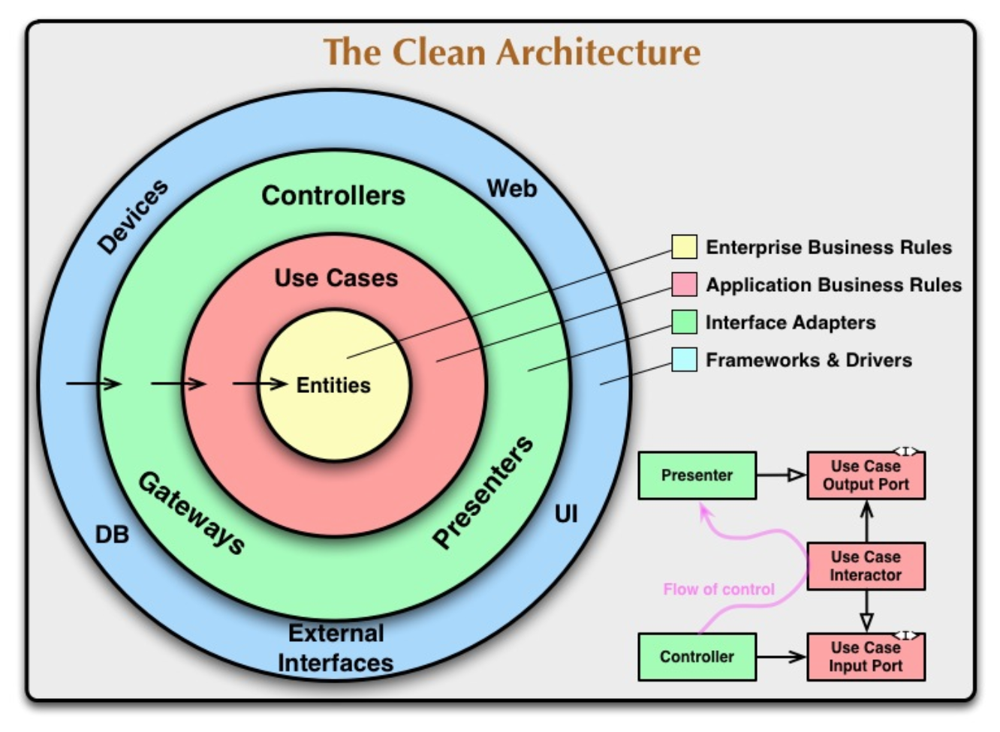

# Go-sample
Go + gRPC with Clean Architecture

## Overview
I was born to learn Golang and Clean Architecture.
Good luck with this encounter!

## At the first startup
1. make compose-up
2. make login-devcontainer
3. make init
4. make db
5. make grpc-list

## Detail
The Go-API directory structure is shown below.
